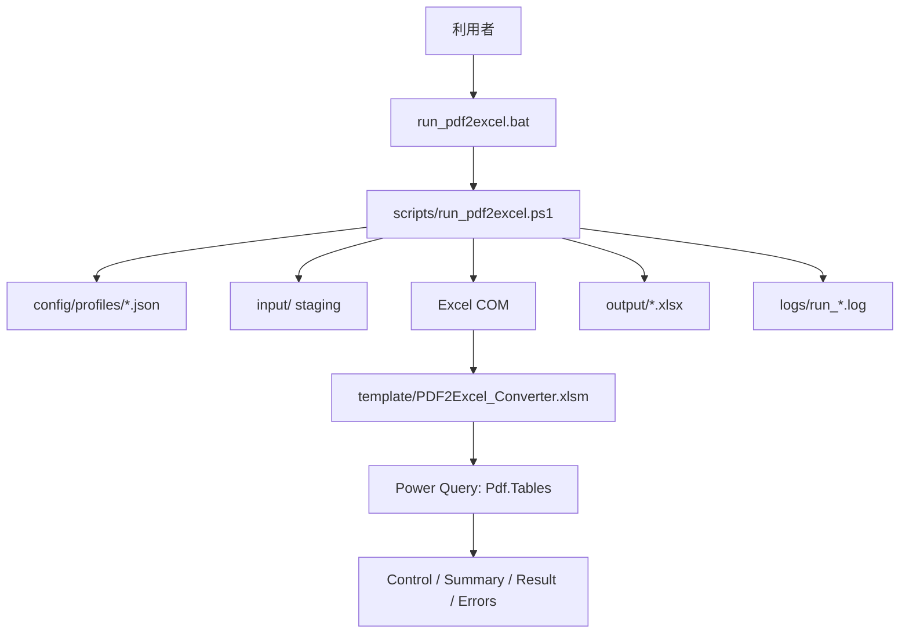
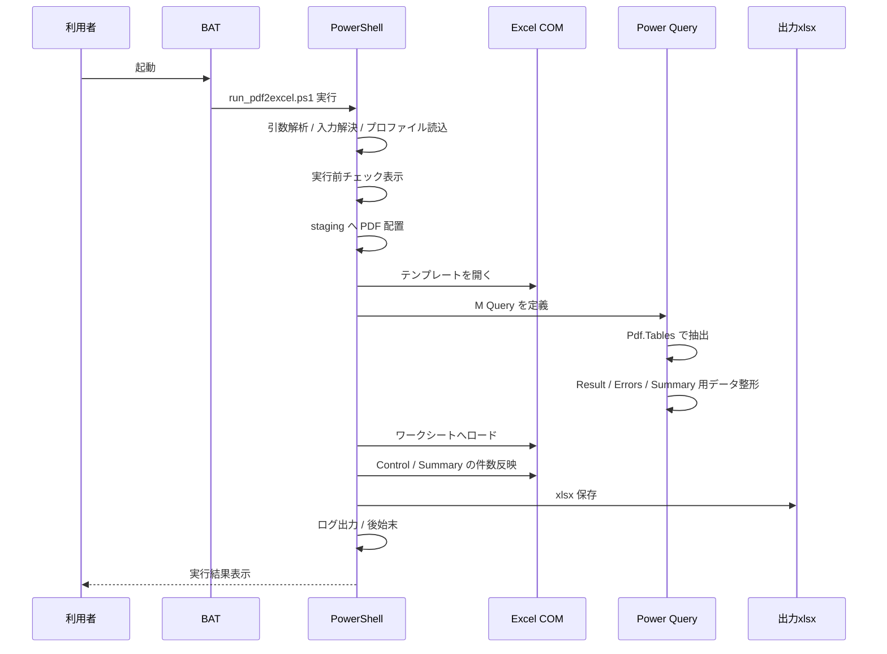

# PDF2Excel 技術説明書

- 作成日: 2026-03-14 05:31 JST
- 作成者: Codex (GPT-5)
- 更新日: 2026-03-14

## 1. 文書の目的

本書は、PDF2Excel システムの技術構成、動作フロー、技術スタック、モジュール責務、データフロー、エラーハンドリング、テスト構成を説明する技術文書です。  
保守担当者が「どのファイルが何をしているか」「どこを直せば何が変わるか」を把握できることを目的とします。

## 2. システムの技術概要

PDF2Excel は、Windows ローカル環境上で動作する Excel 連携型の PDF 表抽出システムです。  
システムの中心は PowerShell スクリプトであり、Excel COM を介してテンプレートブックを開き、Power Query の `Pdf.Tables` を使って PDF の表を抽出し、最終的に `xlsx` を出力します。

実装上の基本方針は次の通りです。

- 利用者の入口は BAT に集約する
- 実処理のオーケストレーションは PowerShell が担う
- PDF 表抽出は Power Query に寄せる
- Excel への最終ロード先はテンプレートワークブックに統一する
- プロファイルにより帳票差分を吸収する
- ログ、Summary、Errors により運用可視性を確保する

## 3. 技術スタック

| 領域 | 技術 | 用途 |
| --- | --- | --- |
| 起動入口 | Windows BAT | 利用者向けメニューと PowerShell 起動 |
| 実行制御 | PowerShell | 入力解決、staging、Excel COM 起動、クエリ設定、保存、ログ |
| UI 補助 | Windows Forms | ファイル選択ダイアログ、フォルダ選択ダイアログ、保存先選択 |
| 抽出エンジン | Excel Power Query / `Pdf.Tables` | PDF 内の表候補抽出 |
| テンプレート | Excel `.xlsm` | 4 シート構成の器、VBA 保持 |
| マクロ | VBA | Excel 側リフレッシュ補助、xlsx エクスポート |
| 設定 | JSON | 帳票プロファイル |
| テスト | PowerShell + Excel COM | 統合テスト、自動 PDF 生成、出力検証 |
| 配布 | PowerShell + ZIP | 最小パッケージ作成 |

## 3.1 実行時依存関係

- Windows
- PowerShell
- Excel(M365) デスクトップ版
- Excel COM
- Power Query
- Windows Forms

## 3.2 設計上の選定理由

- BAT
  - 非技術者でも入口として使いやすいため
- PowerShell
  - Windows 標準で利用しやすく、Excel COM と親和性が高いため
- Power Query / `Pdf.Tables`
  - 追加インストールなしで PDF 表抽出を実現できるため
- VBA
  - Excel ブック内での保存処理とシートコピーを簡潔に扱えるため
- JSON プロファイル
  - 帳票条件をコード外で管理しやすいため

## 4. ディレクトリ構成

```text
PDF2Excel
├─ run_pdf2excel.bat
├─ README.md
├─ config/
│  └─ profiles/
│     └─ default.json
├─ docs/
├─ handoff/
├─ input/
├─ logs/
├─ output/
│  └─ runtime/
├─ reports/
├─ scripts/
│  ├─ run_pdf2excel.ps1
│  ├─ build_excel_template.ps1
│  └─ build_handoff_package.ps1
├─ template/
│  ├─ PDF2Excel_Converter.xlsm
│  └─ vba/
│     └─ PDF2ExcelMacros.bas
└─ tests/
   └─ run_integration_tests.ps1
```

## 5. アーキテクチャ構造



## 5.1 アーキテクチャ上の責務分離

- UI と実行制御は分離する
  - BAT は入口、PowerShell は実処理
- 抽出条件と実装は分離する
  - JSON プロファイルで帳票条件を切り替える
- 抽出結果と運用可視化は分離する
  - Result は明細、Errors は失敗、Summary は集計
- テンプレート生成と実行本体は分離する
  - `build_excel_template.ps1` と `run_pdf2excel.ps1` を分ける

## 6. レイヤ構成

### 6.1 プレゼンテーション層

- `run_pdf2excel.bat`
- PowerShell 上のコンソール出力
- Windows Forms ダイアログ
- Excel 上の `Control` / `Summary` シート

### 6.2 アプリケーション制御層

- `scripts/run_pdf2excel.ps1`

役割:

- 引数処理
- 入力解決
- 実行前チェック
- staging
- プロファイル読込
- Excel 起動
- Power Query 定義投入
- ワークシートロード
- 集計値反映
- 保存
- 後始末

### 6.3 データ抽出層

- Power Query M 式
- `Pdf.Tables`

役割:

- PDF 内の表候補列挙
- 候補表のスコアリング
- 対象表選定
- ヘッダー除外
- 列正規化
- エラー情報の構造化

### 6.4 テンプレート層

- `template/PDF2Excel_Converter.xlsm`
- `template/vba/PDF2ExcelMacros.bas`

役割:

- Excel ブック構成の標準化
- 出力シート構成の固定
- マクロによる `xlsx` エクスポート補助

### 6.5 テスト / 配布層

- `tests/run_integration_tests.ps1`
- `scripts/build_handoff_package.ps1`

役割:

- 実行シナリオの自動検証
- 配布用最小構成の再生成

## 7. 実行フロー



## 8. 実行時の詳細フロー

### 8.1 初期化

`run_pdf2excel.ps1` は次を初期化します。

- ベースディレクトリ
- `input` / `output` / `runtime` / `logs` / `config/profiles` の存在確認
- 実行開始時刻
- ログファイルパス

### 8.2 入力解決

入力解決は `Resolve-InputPdfFiles` が担います。  
入力源は次の優先順です。

1. `-InputFiles`
2. `-InputFolder`
3. `-SelectInputFolder`
4. ファイル選択ダイアログ

検証内容:

- 指定パス存在確認
- 拡張子 `.pdf` 確認
- 空入力の拒否

### 8.3 プロファイル読込

`Get-ProfileConfiguration` が JSON を読込み、次を正規化します。

- `Name`
- `DisplayName`
- `Description`
- `ExpectedColumns`
- `HeaderRowsToSkip`
- `TargetRowCount`
- `AllowMoreColumns`
- `PreferredTableKinds`
- `PreferredTableNameContains`
- `PreferredTableIdContains`
- `SourceFileColumnName`
- `DataColumnPrefix`

プロファイル読込時の検証:

- `expectedColumns >= 1`
- `headerRowsToSkip >= 0`
- `targetRowCount >= 1`
- 省略項目に既定値を補う

### 8.4 実行前チェック

`Get-PreflightState` と `Confirm-Preflight` が処理します。  
表示項目は次の通りです。

- 対象 PDF 数
- 出力ファイル
- 既存ファイル上書き有無
- 使用プロファイル
- 想定列数
- ヘッダー除外行数
- 想定行数
- 代表ファイル名

`-NoConfirm` 指定時は確認入力を省略します。

### 8.5 staging

`Stage-PdfFiles` が `input` フォルダへ対象 PDF を配置します。  
特徴は次の通りです。

- 今回対象外の旧 PDF を除去する
- 同名 PDF 衝突を明示エラーにする
- `input` 自己参照時に自己削除しない

### 8.6 テンプレート準備

`Ensure-Template` が必要に応じて `build_excel_template.ps1` を呼び出します。  
その後 `Copy-TemplateToRuntime` が runtime 用の一時 `xlsm` を生成します。

### 8.7 Excel COM 起動

PowerShell は Excel COM を次の設定で起動します。

- `Visible = false`
- `DisplayAlerts = false`
- `AskToUpdateLinks = false`
- `AutomationSecurity = 1`

目的は、画面を出さずに安定して自動処理することです。

### 8.8 Query 定義

PowerShell はワークブックに次の Query を注入します。

- `PDF2Excel_Staging`
- `PDF2Excel_Result`
- `PDF2Excel_Errors`
- `PDF2Excel_FileSummary`
- `PDF2Excel_ErrorSummary`

注入方式:

- 既存 Query があれば削除して再作成する
- 実行単位ごとに staging 入力パスとプロファイル条件を埋め込んだ M 式を生成する

### 8.9 ワークシートロード

`Load-WorkbookQueryToWorksheet` が Query の結果をワークシートへ ListObject としてロードします。

ロード先:

- `Result` → `tblResult`
- `Errors` → `tblErrors`
- `Summary` → `tblFileSummary`
- `Summary` → `tblErrorSummary`

### 8.10 集計値反映

PowerShell は `Control` と `Summary` に集計値を直接書き込みます。

主な値:

- Source PDF 数
- Result 行数
- Errors 行数
- 成功 PDF 数
- 失敗 PDF 数
- 処理時間
- 使用プロファイル

### 8.11 保存

保存は 2 段構えです。

1. VBA マクロ `ExportResultAsXlsx`
2. マクロが使えない場合は PowerShell 側 `Export-WorkbookDirectly`

この設計により、マクロ無効環境でも出力継続が可能です。

保存形式:

- テンプレート内部は `.xlsm`
- 利用者成果物は `.xlsx`

### 8.12 後始末

最後に次を実行します。

- ワークブック Close
- Excel Quit
- COM 解放
- runtime ファイル削除
- GC 実行

## 9. Power Query の論理構造

### 9.1 `PDF2Excel_Staging`

目的:

- PDF ごとの抽出結果を 1 件 1 レコードで保持する

責務:

- `Folder.Files` で PDF 一覧取得
- `Pdf.Tables` により表候補列挙
- 候補表をスコアリング
- もっとも適切な表を選択
- ヘッダー除外
- 列名正規化
- 空欄補完
- ファイル名列付与
- エラーコード / エラー分類生成

### 9.2 スコアリングロジック

候補表は次の観点で評価されます。

- 想定列数との差
- 想定行数との差
- 優先表種別一致
- 優先表名文字列一致
- 優先表 ID 文字列一致

列数差の重みを最も大きくしており、まず列構造の近さを優先します。

技術的意図:

- 列構造が近い表を最優先することで、列ずれリスクを下げる
- 行数は補助評価として使い、帳票規模の大きく異なる表候補を避ける
- `preferredTableKinds` / `preferredTableNameContains` / `preferredTableIdContains` は、帳票固有の優先候補を前に出すための微調整として使う

### 9.3 `PDF2Excel_Result`

目的:

- 成功データだけを平坦な表として出力する

処理:

- `PDF2Excel_Staging` から `IsError <> true` を抽出
- `Data` 列を展開
- プロファイル定義順で列を整列

### 9.4 `PDF2Excel_Errors`

目的:

- 失敗 PDF を Errors シート向けに整形する

出力列:

- `FileName`
- `ErrorCode`
- `ErrorCategory`
- `UserMessage`
- `TechnicalDetail`
- `CandidateColumns`
- `CandidateRows`
- `TableId`
- `TableKind`
- `TableName`

### 9.5 `PDF2Excel_FileSummary`

目的:

- PDF 単位の成功 / 失敗と件数を Summary シートへ出す

出力列:

- `FileName`
- `Status`
- `ImportedRows`
- `ErrorCategory`
- `ErrorCode`
- `UserMessage`
- `CandidateColumns`
- `CandidateRows`
- `TableKind`
- `TableName`

### 9.6 `PDF2Excel_ErrorSummary`

目的:

- エラー分類ごとの件数集計を Summary シートへ出す

処理:

- 失敗行抽出
- `ErrorCategory` と `ErrorCode` でグループ化
- 件数降順で整列

## 10. シート設計

### 10.1 Control

目的:

- 実行メタ情報の保持
- 利用者の一次確認先

代表項目:

- 入力フォルダ
- 出力ファイル
- ログファイル
- 状態
- 件数
- 使用プロファイル

利用者観点での役割:

- まず最初に見るべき確認シート
- 今回の実行条件と結果件数を 1 画面で把握するためのシート

### 10.2 Summary

目的:

- 全体件数の集計
- PDF 単位サマリー
- エラー分類サマリー

構成:

- 上部: 総括メトリクス
- 左下: `tblFileSummary`
- 右下: `tblErrorSummary`

運用観点での役割:

- 全件成功か、一部失敗かを数秒で判断する
- どの PDF が失敗したかを Errors を開く前に把握する
- エラー傾向を分類単位で見る

### 10.3 Result

目的:

- 正常データの最終出力

構造:

- 1行目ヘッダー
- A列: ファイル名
- B列以降: 帳票データ

後続利用想定:

- Excel での目視確認
- フィルタ / 並べ替え / 集計
- 他システム取り込み前の中間データ

### 10.4 Errors

目的:

- 失敗 PDF の一覧
- 障害切り分けの一次情報

運用上の使い方:

- 利用者は `UserMessage` と `ErrorCategory` を主に見る
- 保守者は `TechnicalDetail`、候補列数、候補表情報まで見る

## 10.5 シート間の関係

- `Control`
  - 実行条件と結果件数の要約
- `Summary`
  - 件数集計と PDF 単位の一覧
- `Result`
  - 成功データの本体
- `Errors`
  - 失敗データの本体

この 4 シートは役割が重複しないように分けている。

## 11. モジュール責務

### 11.1 `run_pdf2excel.bat`

責務:

- 利用者向けメニュー表示
- PowerShell スクリプト起動
- マニュアル / 出力 / プロファイルフォルダ起動
- 非対話実行時の単純なラッパー

### 11.2 `scripts/run_pdf2excel.ps1`

責務:

- システムのメインオーケストレーション

主要関数:

- `Resolve-InputPdfFiles`
- `Get-ProfileConfiguration`
- `Stage-PdfFiles`
- `Get-StagingQueryFormula`
- `Get-ResultQueryFormula`
- `Get-ErrorsQueryFormula`
- `Get-FileSummaryQueryFormula`
- `Get-ErrorSummaryQueryFormula`
- `Load-WorkbookQueryToWorksheet`
- `Set-ControlValues`
- `Set-ControlMetrics`
- `Set-SummaryMetrics`

補助関数カテゴリ:

- 入出力解決
- プロファイル読込
- Query 文字列生成
- ワークシートロード
- メトリクス反映
- 事前確認
- 後始末

### 11.3 `scripts/build_excel_template.ps1`

責務:

- テンプレートブックの再生成
- シート数補正
- `Control` / `Summary` / `Result` / `Errors` の初期レイアウト設定
- VBA モジュール取り込み

### 11.4 `template/vba/PDF2ExcelMacros.bas`

責務:

- Excel 側リフレッシュ処理
- `xlsx` エクスポート
- 出力先フォルダの自動作成

### 11.5 `config/profiles/default.json`

責務:

- 既定帳票条件の定義

### 11.6 `tests/run_integration_tests.ps1`

責務:

- テスト用 PDF の自動生成
- 実変換実行
- 出力ブック検査
- レポート生成

### 11.7 `scripts/build_handoff_package.ps1`

責務:

- 最小配布フォルダ生成
- zip 生成
- 配布用空フォルダの初期化

## 12. エラーハンドリング設計

### 12.1 PDF 単位の失敗

PDF 単位の失敗は Query 側で吸収し、`Errors` へ送ります。  
典型例:

- `PDF_READ_FAILURE`
- `TABLE_NOT_FOUND`
- `COLUMN_OVERFLOW`
- `UNEXPECTED_PROCESSING_ERROR`

### 12.2 実行全体の失敗

実行全体の失敗は PowerShell 側で補足し、ログへ分類付きで出します。  
典型例:

- `RUN_CANCELLED`
- `DUPLICATE_FILE_NAME`
- `INPUT_RESOLUTION_ERROR`
- `TEMPLATE_ERROR`
- `EXCEL_RUNTIME_ERROR`
- `UNEXPECTED_RUN_ERROR`

### 12.3 フォールバック設計

VBA 実行に失敗しても、PowerShell 側保存へ切り替えて継続します。  
このため、マクロ無効環境でも致命停止しにくい構造です。

## 12.4 エラー分類の責務分担

- Query 側
  - PDF 単位の抽出失敗を分類する
- PowerShell 側
  - 実行全体の失敗を分類する
- Excel シート側
  - 利用者が読める形で可視化する

## 12.5 復旧方針

- PDF 単位失敗は継続優先
- 実行全体失敗はログへ分類付きで記録し停止
- runtime と COM 解放は finally で回収する

## 13. runtime / ログ / 生成物の扱い

### runtime

- 一時 `xlsm` を配置
- 実行開始時 compaction
- 実行終了時削除

### logs

- `run_yyyyMMdd_HHmmss.log`
- 1 実行 1 ログ

ログ粒度:

- `INFO`
- `WARN`
- `ERROR`

### output

- 最終 `xlsx`
- 利用者成果物置き場

## 13.1 ログフォーマット

ログは次の形式で出力される。

```text
yyyy-MM-dd HH:mm:ss [LEVEL] Message
```

この形式により、時系列と重要度を人間が即座に追いやすくしている。

## 13.2 一時ファイル戦略

- runtime は実行単位の `xlsm`
- 配布時には空フォルダを維持する
- `.gitkeep` により空ディレクトリを管理する

## 14. テスト構成

統合テストでは次を確認します。

- テンプレート再生成
- PowerShell 正常変換
- 単票 PDF
- `-InputFiles`
- BAT 実行
- BAT 非対話
- `input` 自己参照
- 同名 PDF 拒否
- 壊れた PDF 混在
- 深い出力先
- プロファイル切替
- runtime 清掃
- Excel プロセス残留なし

## 14.1 テスト設計の考え方

- 正常系だけでなく、運用事故になりやすい異常系も自動化する
- 実際に Excel COM を起動し、実ブックを開いて確認する
- 件数整合とプロセス残留の両方を見る

## 14.2 テストレポート生成

- `reports/test-report.md`
- `tests/results/integration-test-results.json`

md は人間確認用、json は再利用・機械処理用という位置づけである。

## 15. 配布構成

配布用最小パッケージには次のみ含めます。

- `run_pdf2excel.bat`
- `scripts/run_pdf2excel.ps1`
- `template/PDF2Excel_Converter.xlsm`
- `config/profiles/default.json`
- 空の `input` / `output` / `logs`
- 配布用簡易マニュアル

## 15.1 配布最小化方針

- 開発用資料、テスト、サンプルは配布しない
- 実行に必要なテンプレート、設定、実行スクリプトだけを残す
- 配布先が追加インストールなしで試せることを優先する

## 16. 保守時の主な変更ポイント

### 帳票条件を変えたい

- まず `config/profiles/*.json`
- 必要なら `Get-StagingQueryFormula`

### シート見た目を変えたい

- `build_excel_template.ps1`
- `PDF2ExcelMacros.bas`

### 実行手順や対話を変えたい

- `run_pdf2excel.bat`
- `run_pdf2excel.ps1`
- ドキュメント一式

### テストを増やしたい

- `tests/run_integration_tests.ps1`

## 16.1 変更影響の見方

- プロファイル仕様変更
  - 抽出対象、Result 列数、Errors 判定へ影響
- Query 変更
  - Result / Errors / Summary の全体へ影響
- シート構成変更
  - テンプレート再生成、VBA、テストへ影響
- BAT 変更
  - 利用者導線、非対話実行へ影響

## 17. 既知の技術的限界

- `Pdf.Tables` の認識品質に依存する
- OCR 非対応
- 帳票差分が極端に大きい場合は設定だけでは吸収できない
- Excel COM 利用のため、Windows / Excel 依存が強い

## 17.1 技術的注意点

- PowerShell の文字コード差異により、スクリプト保存形式は実行性へ影響する
- Excel COM は RCW 解放順を誤ると不安定になる
- QueryTable の配置位置が競合すると `0x800A03EC` が発生しやすい
- VBA は無効化される環境があるため、フォールバック保存を維持する必要がある

## 18. 推奨保守方針

1. まずプロファイルで吸収できるか考える
2. 次に Query の条件調整を検討する
3. その後に UI 文言や文書を合わせる
4. 最後に統合テストと配布パッケージを更新する

## 19. 付録: 主要インターフェース

### 19.1 BAT インターフェース

- 対話メニューによる実行
- 引数透過による非対話実行

### 19.2 PowerShell 引数インターフェース

- `-InputFolder`
- `-InputFiles`
- `-OutputFile`
- `-ProfileName`
- `-ProfilePath`
- `-KeepInput`
- `-RebuildTemplate`
- `-OpenOutput`
- `-OpenOutputFolder`
- `-SelectInputFolder`
- `-PromptForOutputFile`
- `-NoConfirm`
- `-Help`

### 19.3 Excel ブックインターフェース

- `Control`
- `Summary`
- `Result`
- `Errors`

### 19.4 配布インターフェース

- 最小配布フォルダ
- zip 形式配布物
- 同梱マニュアル
